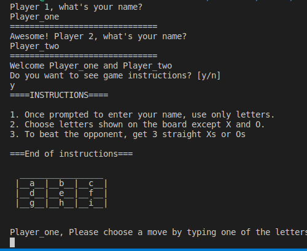
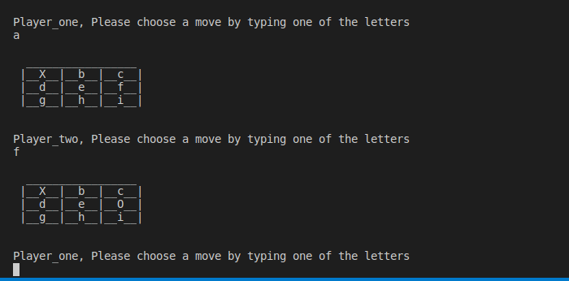
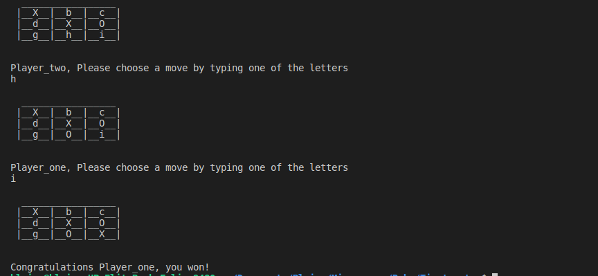

# Tic-tac-toe

Tic-tac-toe, noughts and crosses, or Xs and Os, is a paper-and-pencil game for two players, X and O, who take turns marking the spaces in a 3×3 grid. The player who succeeds in placing three of their marks in a horizontal, vertical, or diagonal row is the winner. 

## Built With

- Ruby
- Rubocop

## Getting Started

To get a local copy up and running follow these simple example steps.

### Prerequisites

- Ruby >= 2.7.0 

### Install

- `git clone` [repo](https://github.com/Blaise-Shyaka/Tic-tac-toe)
- `cd Tic-tac-toe`

### Start the game

- In the command line, `cd bin`.
- Run `ruby main.rb` to start the game.
- The first player will be shown a prompt to enter their name. Please type your name but make sure it is less than 10 characters.
- The second player will be prompted to enter their name as well. As mentioned earlier, it should be less than 10 characters
- Next, you will be asked if you want to see instructions. Press 'y' if yes!
- A board will be displayed with letters of the alphabet between 'a' and 'i'.

### How the game is played
- The game is played on a 3 by 3 grid.
- You are X and your friend is O.
- When a player chooses a letter on the board, It will be replaced by her respective sign (X or O)
- The first player to get 3 of her signs in a row horizontally, vertically or diagonally is the winner.
- When all the 9 squares are full, and there is no player with three of her marks in a row, the game ends in a tie.

### How to win the game

- Let's assume your sign is X and another player's sign is O
- One part of the strategy is to figure out how to get Xs in a row. The other part is to find a way to stop the other player to get straight Os.
- After you select a letter on the board and is replaced by X, start looking ahead. Look at the letters and figure out which ones can make you have 3 straight Xs 
- You should also watch where the friend places her O. It could change what you do next. If there are two Os in a row you might want to block it with a letter in the last square of that row.

## Authors

👤 **Blaise Pascal SHYAKA**

- GitHub: [@Blaise-Shyaka](https://github.com/Blaise-Shyaka/)
- Twitter: [@blaise_shyaka95](https://twitter.com/blaise_shyaka95)
- LinkedIn: [Blaise Pascal SHYAKA](https://linkedin.com/in/blaise-pascal-shyaka-b1340b111)

## 🤝 Contributing

Contributions, issues, and feature requests are welcome!

Feel free to check the [issues page](https://github.com/Blaise-Shyaka/Tic-tac-toe/issues).

## Show your support

Give a ⭐️ if you like this project!

## Acknowledgments

- The Cupids team for review and suggestions

## 📝 License

This project is [MIT](./README.md) licensed.